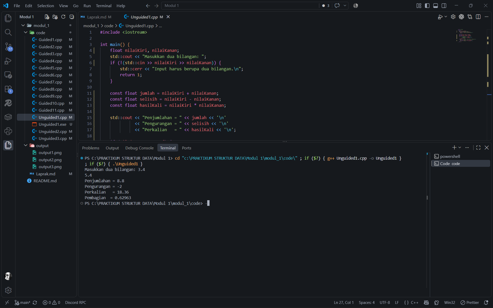
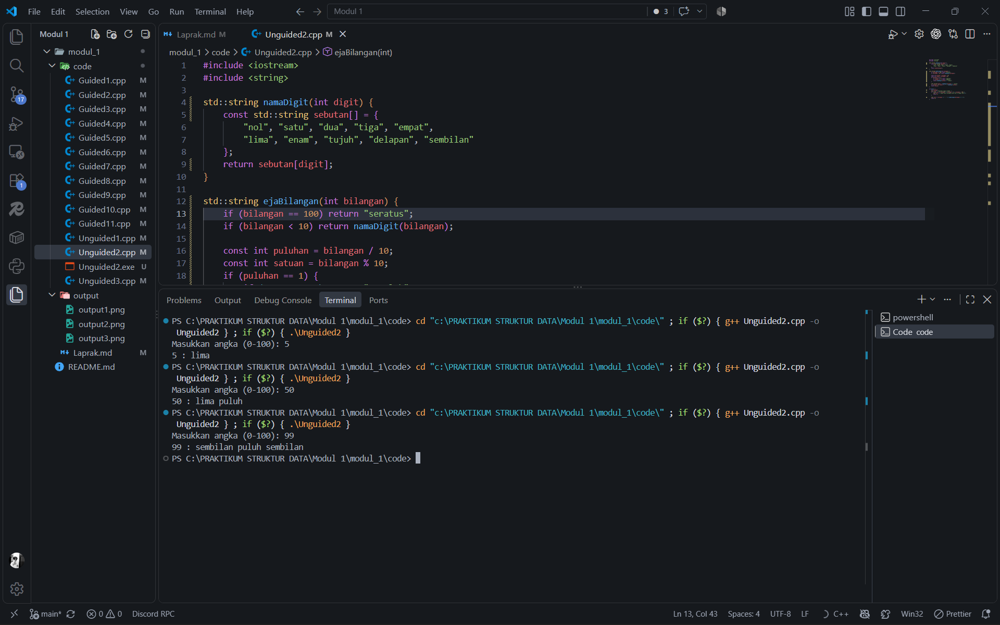
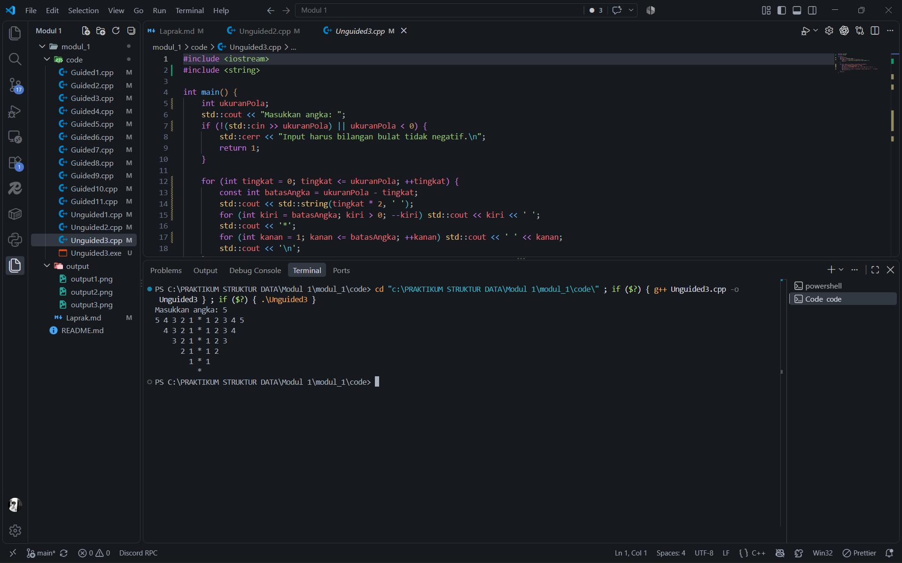

<h1 align="center">Laporan Praktikum Modul 1 - CodeBlocks IDE & Pengenalan Bahasa C++ (Bagian Pertama)</h1>

<p align="center">Akhmad Noval Annur - 109082500100 - S1IF-13-04</p>

## Dasar Teori

### A. Struktur Data dan Elemen Dasar C++<br/>

#### 1. Struktur data

Struktur data adalah cara mengatur dan menyimpan data agar dapat digunakan secara efisien. Triase mengelompokkan array dan record sebagai struktur data sederhana, sedangkan stack, queue, list, tree, dan graph termasuk struktur yang lebih kompleks. Pemilihan struktur data yang sesuai membantu menghasilkan algoritma yang jelas dan program yang sederhana [1].

#### 2. Variabel dan tipe data

Variabel menyimpan nilai yang dapat berubah selama program berjalan, sedangkan konstanta menyimpan nilai tetap. Tipe data menentukan jenis nilai serta operasi yang dapat diterapkan. Bilangan bulat dapat disimpan dengan `int`, bilangan pecahan dengan `float`, dan teks dengan `string`. Selain tipe dasar, C++ menyediakan tipe bentukan seperti `struct` untuk mengelompokkan beberapa field yang berkaitan [2].

#### 3. Struktur program serta input dan output

Program C++ memakai `main()` sebagai titik awal eksekusi. Pustaka `<iostream>` menyediakan `cin` untuk membaca masukan dan `cout` untuk menampilkan keluaran. Sebuah program dapat membaca nilai, mengolahnya melalui ekspresi, lalu menampilkan hasil perhitungan tersebut [2].

### B. Operasi dan Alur Program<br/>

#### 1. Operator dan ekspresi

Ekspresi menggabungkan operand dan operator untuk menghasilkan nilai. Operator aritmatika digunakan untuk perhitungan, sedangkan operator relasional menghasilkan kondisi benar atau salah. Jenis operand memengaruhi hasil: pembagian dua bilangan bulat menghasilkan nilai bulat sebelum disimpan ke variabel bertipe pecahan. Operator `++` menambah nilai satu; letaknya sebelum atau sesudah variabel menentukan kapan nilai baru dipakai [2].

#### 2. Percabangan

Percabangan memilih langkah berdasarkan kondisi. `if` menjalankan blok ketika kondisi benar, `if-else` menyediakan jalur lain ketika kondisi salah, dan `switch` memilih tindakan berdasarkan beberapa nilai yang mungkin. Konsep ini digunakan dalam penentuan diskon dan pengubahan angka menjadi tulisan pada praktikum [2].

#### 3. Perulangan, fungsi, dan struktur

Perulangan menjalankan langkah yang sama berulang kali dengan syarat berhenti; C++ menyediakan bentuk `for`, `while`, dan `do-while`. Fungsi memisahkan pekerjaan tertentu dari program utama dan dapat mengembalikan hasil. Array menyimpan sejumlah elemen sejenis, sementara `struct` dapat menyatukan data berlainan jenis, misalnya nama dan nilai siswa [1][2].

## Guided

### 1. Operator aritmatika dan pembagian integer

```cpp
#include <iostream>

int main() {
    int angkaUtama = 9;
    int tambahan = 4;
    int pembagiAwal = 3;
    int pembagiLain = 2;
    float hasil = (angkaUtama + tambahan) / (pembagiAwal + pembagiLain);
    std::cout << "Hasil pembagian integer = " << hasil << '\n';
    return 0;
}
```

Semua operand pembagian bertipe `int`, sehingga hasil `(9 + 4) / (3 + 2)` adalah `2`, meskipun disimpan ke variabel `float`.

### 2. Pre-increment

```cpp
#include <iostream>

int main() {
    int penghitung = 7;
    int hasilTambah = 5 + ++penghitung;
    std::cout << "Penghitung = " << penghitung
              << "\nHasil tambah = " << hasilTambah << '\n';
    return 0;
}
```

`++penghitung` menaikkan nilai dari `7` ke `8` sebelum penjumlahan; `hasilTambah` bernilai `13`.

### 3. Post-increment

```cpp
#include <iostream>

int main() {
    int penghitung = 7;
    int hasilTambah = 5 + penghitung++;
    std::cout << "Penghitung = " << penghitung
              << "\nHasil tambah = " << hasilTambah << '\n';
    return 0;
}
```

`penghitung++` memakai nilai lama `7` untuk penjumlahan, lalu menaikkannya ke `8`; `hasilTambah` bernilai `12`.

### 4. Percabangan `if`

```cpp
#include <iostream>

int main() {
    double nilaiBelanja;
    std::cout << "Total pembelian: Rp";
    if (!(std::cin >> nilaiBelanja) || nilaiBelanja < 0) return 1;
    double potonganHarga = 0;
    if (nilaiBelanja >= 100000) potonganHarga = nilaiBelanja * 5 / 100;
    std::cout << "Besar diskon = Rp" << potonganHarga << '\n';
    return 0;
}
```

Pembelian minimal Rp100.000 memperoleh potongan 5%. Jika tidak memenuhi batas tersebut, potongan tetap nol.

### 5. Percabangan `if-else`

```cpp
#include <iostream>

int main() {
    double nilaiBelanja;
    std::cout << "Total pembelian: Rp";
    if (!(std::cin >> nilaiBelanja) || nilaiBelanja < 0) return 1;
    double potonganHarga;
    if (nilaiBelanja >= 100000) {
        potonganHarga = nilaiBelanja * 5 / 100;
    } else {
        potonganHarga = 0;
    }
    std::cout << "Besar diskon = Rp" << potonganHarga << '\n';
    return 0;
}
```

Program menghitung diskon dengan aturan yang sama, tetapi cabang tanpa diskon ditulis secara eksplisit pada `else`.

### 6. Pemilihan `switch`

```cpp
#include <iostream>

int main() {
    int nomorHari;
    std::cout << "Kode hari (1=Senin, ..., 7=Minggu): ";
    if (!(std::cin >> nomorHari)) return 1;
    switch (nomorHari) {
        case 1: case 2: case 3: case 4: case 5:
            std::cout << "Hari Kerja\n";
            break;
        case 6: case 7:
            std::cout << "Hari Libur\n";
            break;
        default:
            std::cout << "Kode masukan salah\n";
    }
    return 0;
}
```

Kode hari 1–5 ditampilkan sebagai hari kerja, kode 6–7 sebagai hari libur, dan kode lainnya dianggap tidak valid.

### 7. Perulangan `for`

```cpp
#include <iostream>

int main() {
    int banyakUlangan;
    std::cout << "Jumlah perulangan: ";
    if (!(std::cin >> banyakUlangan) || banyakUlangan < 0) return 1;
    for (int urutan = 1; urutan <= banyakUlangan; ++urutan) {
        std::cout << urutan << ". Saya belajar C++\n";
    }
    return 0;
}
```

Perulangan mencetak kalimat “Saya belajar C++” dengan nomor urut sebanyak masukan pengguna.

### 8. Perulangan `while`

```cpp
#include <iostream>

int main() {
    int banyakBaris;
    std::cout << "Masukkan banyak baris: ";
    if (!(std::cin >> banyakBaris) || banyakBaris < 0) return 1;
    int nomorBaris = 1;
    while (nomorBaris <= banyakBaris) {
        std::cout << "baris ke-" << nomorBaris << '\n';
        ++nomorBaris;
    }
    return 0;
}
```

Selama `nomorBaris` belum melebihi jumlah yang diminta, program menampilkan nomor baris dan menaikkan penghitung.

### 9. Perulangan `do-while`

```cpp
#include <iostream>

int main() {
    int banyakBaris;
    std::cout << "Masukkan banyak baris: ";
    if (!(std::cin >> banyakBaris)) return 1;
    int nomorBaris = 1;
    do {
        std::cout << "baris ke-" << nomorBaris << '\n';
        ++nomorBaris;
    } while (nomorBaris <= banyakBaris);
    return 0;
}
```

Blok `do` dijalankan sebelum kondisi diperiksa, sehingga setidaknya satu baris dicetak.

### 10. Array dan `struct`

```cpp
#include <iostream>
#include <string>

struct CatatanNilai {
    std::string namaLengkap;
    int skor;
};

int main() {
    const int kapasitas = 5;
    CatatanNilai daftar[kapasitas];
    for (int posisi = 0; posisi < kapasitas; ++posisi) {
        std::cout << "Data ke-" << posisi + 1 << "\nNama: ";
        std::getline(std::cin >> std::ws, daftar[posisi].namaLengkap);
        std::cout << "Nilai: ";
        if (!(std::cin >> daftar[posisi].skor)) return 1;
    }
    std::cout << "\nData siswa\n";
    for (int posisi = 0; posisi < kapasitas; ++posisi) {
        std::cout << posisi + 1 << ". " << daftar[posisi].namaLengkap
                  << " - " << daftar[posisi].skor << '\n';
    }
    return 0;
}
```

Tipe `CatatanNilai` menggabungkan nama dan skor. Lima catatan disimpan dalam array lalu ditampilkan kembali.

### 11. Fungsi konversi suhu

```cpp
#include <iostream>

float ubahSuhu(float derajatC) {
    return (derajatC * 9.0f / 5.0f) + 32.0f;
}

int main() {
    float suhuCelsius;
    std::cout << "Nilai Celsius: ";
    if (!(std::cin >> suhuCelsius)) return 1;
    const float suhuFahrenheit = ubahSuhu(suhuCelsius);
    std::cout << suhuCelsius << " Celsius adalah "
              << suhuFahrenheit << " Fahrenheit\n";
    return 0;
}
```

Fungsi `ubahSuhu` menerima nilai Celsius dan mengembalikan Fahrenheit berdasarkan rumus `C × 9/5 + 32`.

## Unguided

### 1. Operasi dua bilangan `float`

**Soal:** Buat program yang menerima dua bilangan bertipe `float`, lalu menampilkan penjumlahan, pengurangan, perkalian, dan pembagiannya.

```cpp
#include <iostream>

int main() {
    float nilaiKiri, nilaiKanan;
    std::cout << "Masukkan dua bilangan: ";
    if (!(std::cin >> nilaiKiri >> nilaiKanan)) {
        std::cerr << "Input harus berupa dua bilangan.\n";
        return 1;
    }

    const float jumlah = nilaiKiri + nilaiKanan;
    const float selisih = nilaiKiri - nilaiKanan;
    const float hasilKali = nilaiKiri * nilaiKanan;

    std::cout << "Penjumlahan = " << jumlah << '\n'
              << "Pengurangan = " << selisih << '\n'
              << "Perkalian   = " << hasilKali << '\n';

    if (nilaiKanan == 0.0f) {
        std::cout << "Pembagian  = tidak terdefinisi (pembagi nol)\n";
    } else {
        const float hasilBagi = nilaiKiri / nilaiKanan;
        std::cout << "Pembagian  = " << hasilBagi << '\n';
    }
    return 0;
}
```

### Output Unguided 1 :

##### Output 1



Program membaca dua bilangan, menghitung tiga hasil pertama, dan hanya melakukan pembagian jika bilangan kedua bukan nol. Pada dokumentasi di atas, input `3.4` dan `5.4` menghasilkan jumlah `8.8`, selisih `-2`, perkalian `18.36`, dan pembagian sekitar `0.62963`.

### 2. Mengubah angka 0–100 menjadi tulisan

**Soal:** Buat program yang menerima bilangan bulat dari 0 sampai 100 dan menampilkan angka tersebut dalam bentuk tulisan.

```cpp
#include <iostream>
#include <string>

std::string namaDigit(int digit) {
    const std::string sebutan[] = {
        "nol", "satu", "dua", "tiga", "empat",
        "lima", "enam", "tujuh", "delapan", "sembilan"
    };
    return sebutan[digit];
}

std::string ejaBilangan(int bilangan) {
    if (bilangan == 100) return "seratus";
    if (bilangan < 10) return namaDigit(bilangan);

    const int puluhan = bilangan / 10;
    const int satuan = bilangan % 10;
    if (puluhan == 1) {
        if (satuan == 0) return "sepuluh";
        if (satuan == 1) return "sebelas";
        return namaDigit(satuan) + " belas";
    }

    std::string bacaan = namaDigit(puluhan) + " puluh";
    if (satuan > 0) bacaan += " " + namaDigit(satuan);
    return bacaan;
}

int main() {
    int bilangan;
    std::cout << "Masukkan angka (0-100): ";
    if (!(std::cin >> bilangan) || bilangan < 0 || bilangan > 100) {
        std::cerr << "Input harus bilangan bulat dari 0 sampai 100.\n";
        return 1;
    }

    std::cout << bilangan << " : " << ejaBilangan(bilangan) << '\n';
    return 0;
}
```

### Output Unguided 2 :

##### Output 1



Program memisahkan angka menjadi puluhan dan satuan. Angka 10, 11, dan 100 ditangani sebagai kasus khusus; angka lainnya dirangkai dari sebutan digit. Dokumentasi memperlihatkan `5 : lima`, `50 : lima puluh`, dan `99 : sembilan puluh sembilan`.

### 3. Pola mirror

**Soal:** Buat program yang menampilkan pola angka simetris dengan tanda `*` di tengah sesuai contoh pada modul.

```cpp
#include <iostream>
#include <string>

int main() {
    int ukuranPola;
    std::cout << "Masukkan angka: ";
    if (!(std::cin >> ukuranPola) || ukuranPola < 0) {
        std::cerr << "Input harus bilangan bulat tidak negatif.\n";
        return 1;
    }

    for (int tingkat = 0; tingkat <= ukuranPola; ++tingkat) {
        const int batasAngka = ukuranPola - tingkat;
        std::cout << std::string(tingkat * 2, ' ');
        for (int kiri = batasAngka; kiri > 0; --kiri) std::cout << kiri << ' ';
        std::cout << '*';
        for (int kanan = 1; kanan <= batasAngka; ++kanan) std::cout << ' ' << kanan;
        std::cout << '\n';
    }
    return 0;
}
```

### Output Unguided 3 :

##### Output 1



Program mengecilkan batas angka pada setiap baris, mencetak angka menurun di kiri `*` dan angka menaik di kanan. Indentasi bertambah dua spasi per baris hingga tersisa satu tanda `*`, seperti dokumentasi untuk input `5`.

## Kesimpulan

Praktikum ini menunjukkan bahwa tipe data dan operator memengaruhi hasil perhitungan, sementara percabangan dan perulangan menentukan alur program. Fungsi serta `struct` membantu menyusun program ketika data dan proses menjadi lebih banyak. Ketiga latihan menerapkan konsep tersebut pada aritmatika, terbilang, dan pola mirror.

## Referensi

[1] Triase. (2020). *Diktat Edisi Revisi: Struktur Data*. Universitas Islam Negeri Sumatera Utara, Medan. [Dokumen PDF](https://repository.uinsu.ac.id/9717/2/Diktat%20Struktur%20Data.pdf).

[2] Indahyanti, U., & Rahmawati, Y. (2020). *Buku Ajar Algoritma dan Pemrograman dalam Bahasa C++*. Umsida Press. [https://doi.org/10.21070/2020/978-623-6833-67-4](https://doi.org/10.21070/2020/978-623-6833-67-4).
