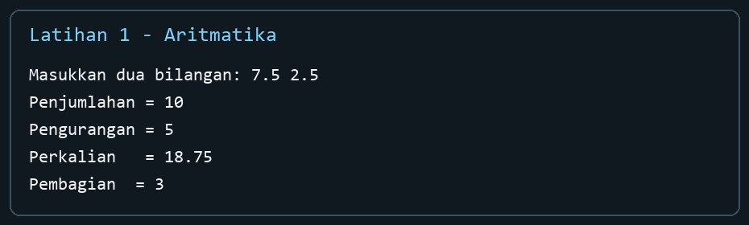
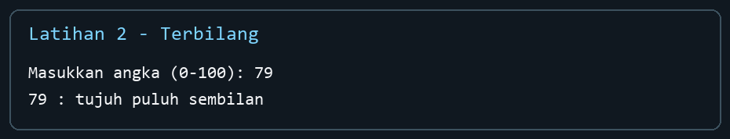
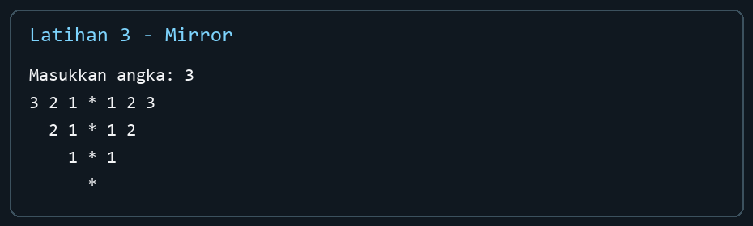

# Laporan Praktikum Struktur Data — Modul 1

**Nama:** Akhmad Noval Annur  
**NIM:** 109082500100  
**Kelas:** S1IF-13-04

## Judul dan tujuan

**Code::Blocks IDE & Pengenalan Bahasa C++ (Bagian Pertama).** Praktikum ini melatih penggunaan input/output, variabel dan tipe data, operator, percabangan, perulangan, struktur, serta fungsi dalam C++.

## Dasar teori singkat

- `cin` membaca data dari masukan standar, sedangkan `cout` menampilkan hasil.
- Tipe `float` menyimpan bilangan pecahan. Pembagian dengan pembagi nol perlu ditangani sebelum operator `/` digunakan.
- `if`, `else`, dan `switch` memilih tindakan berdasarkan kondisi. `for`, `while`, dan `do-while` mengulang tindakan dengan aturan berhenti yang jelas.
- `struct` mengelompokkan beberapa data, sedangkan fungsi memisahkan perhitungan yang dapat digunakan kembali.

## Guided

Contoh terpandu pada modul ditulis ulang sebagai program terpisah. Beberapa kesalahan ketik pada contoh di PDF diperbaiki agar setiap program dapat dikompilasi.

| File | Konsep | Hasil/pembahasan singkat |
| --- | --- | --- |
| [Guided1.cpp](code/Guided1.cpp) | Operator aritmatika | `(7 + 3) / (3 + 1)` menghasilkan `2` karena operand bertipe `int`. |
| [Guided2.cpp](code/Guided2.cpp) | Pre-increment | `++r` menaikkan `r` sebelum digunakan; `r = 11`, `s = 21`. |
| [Guided3.cpp](code/Guided3.cpp) | Post-increment | `r++` menggunakan nilai lama lebih dulu; `r = 11`, `s = 20`. |
| [Guided4.cpp](code/Guided4.cpp) | `if` | Diskon 5% diberikan jika total pembelian minimal Rp100.000. |
| [Guided5.cpp](code/Guided5.cpp) | `if-else` | Kasus tanpa diskon ditulis eksplisit pada cabang `else`. |
| [Guided6.cpp](code/Guided6.cpp) | `switch` | Kode 1–5 adalah hari kerja, 6–7 hari libur. |
| [Guided7.cpp](code/Guided7.cpp) | `for` | Menulis “saya pintar” sebanyak input. |
| [Guided8.cpp](code/Guided8.cpp) | `while` | Menulis nomor baris dari 1 sampai input. |
| [Guided9.cpp](code/Guided9.cpp) | `do-while` | Menunjukkan bahwa isi perulangan dijalankan setidaknya sekali. |
| [Guided10.cpp](code/Guided10.cpp) | Array `struct` | Menyimpan nama dan nilai lima siswa lalu menampilkannya kembali. |
| [Guided11.cpp](code/Guided11.cpp) | Fungsi | Mengubah Celsius ke Fahrenheit dengan rumus `C × 1,8 + 32`. |

## Unguided — Latihan 1.11

### 1. Empat operasi dua bilangan float

**Soal:** Baca dua bilangan bertipe `float`, lalu tampilkan penjumlahan, pengurangan, perkalian, dan pembagian.

**Jawaban:** [Unguided1.cpp](code/Unguided1.cpp). Kedua masukan disimpan sebagai `float`; empat operasi memakai operator `+`, `-`, `*`, dan `/`. Jika bilangan kedua nol, program menjelaskan bahwa hasil pembagian tidak terdefinisi.

**Contoh:** Untuk input `7.5 2.5`, hasilnya berturut-turut `10`, `5`, `18.75`, dan `3`.



### 2. Angka 0–100 menjadi tulisan

**Soal:** Baca bilangan bulat dari 0 sampai 100 dan tampilkan ejaan bahasa Indonesianya. Contoh pada modul: `79 : tujuh puluh sembilan`.

**Jawaban:** [Unguided2.cpp](code/Unguided2.cpp). Nilai 0–9 mengambil kata satuan; 10 dan 11 memiliki nama khusus; 12–19 memakai akhiran `belas`; 20–99 memakai kata puluhan dan, jika ada, satuan; 100 menjadi `seratus`. Input di luar rentang ditolak sebelum diproses.

**Contoh:** `79 : tujuh puluh sembilan`. Kasus tepi: `0 : nol`, `11 : sebelas`, `100 : seratus`.



### 3. Pola mirror

**Soal:** Tampilkan pola angka simetris dengan tanda `*` di tengah sesuai gambar pada modul.

**Jawaban:** [Unguided3.cpp](code/Unguided3.cpp). Baris dimulai dari angka input dan berkurang sampai nol. Pada tiap baris, angka di kiri menurun menuju 1, angka di kanan naik mulai 1, dan dua spasi ditambahkan di awal setiap baris berikutnya.

**Contoh untuk input 3:**

```text
3 2 1 * 1 2 3
  2 1 * 1 2
    1 * 1
      *
```



## Kesimpulan

Ketiga latihan menerapkan dasar C++ pada persoalan yang berbeda: perhitungan numerik, pengambilan keputusan untuk terbilang, dan perulangan bertingkat untuk pola. Setiap program dapat dijalankan sendiri sehingga input, proses, dan hasilnya dapat diperiksa secara terpisah.

## Sumber

- *Modul 01 STUKDAT.pdf*, Modul 1, terutama bagian 1.3–1.11 (dokumen soal yang diberikan).
- [Struktur repo contoh Leonardo Farriz Garcya](https://github.com/leonardo0138/109082530036_Leonardo-Farriz-Garcya_SDT) digunakan sebagai acuan penamaan folder dan file.
