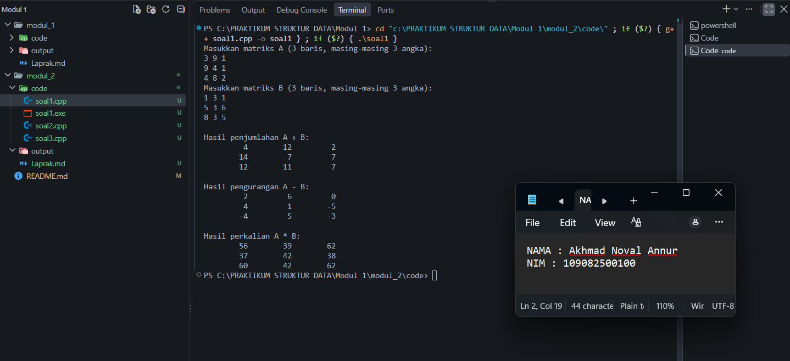
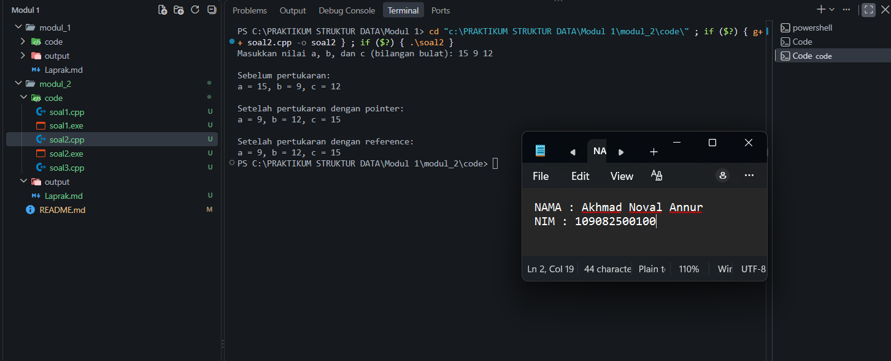
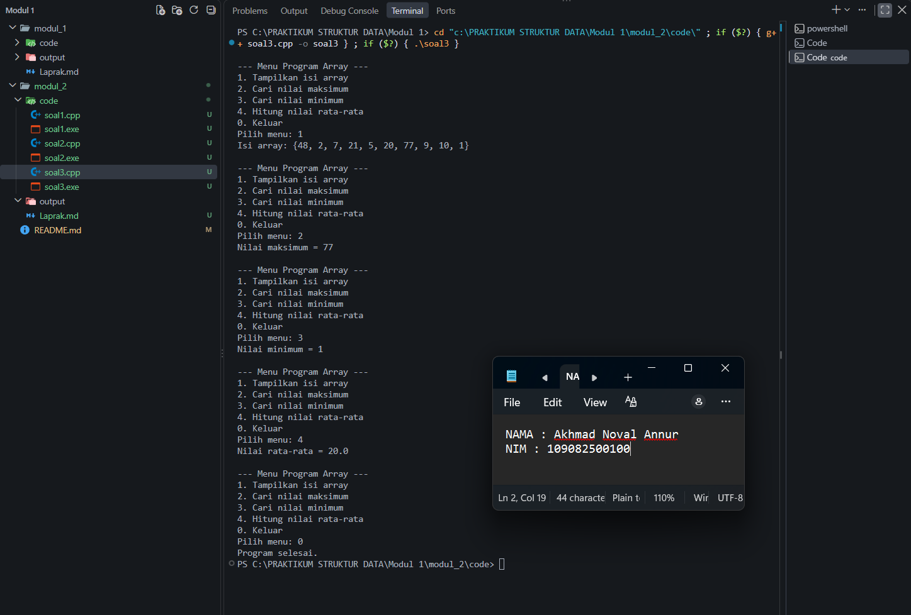

# Laporan Latihan Soal Struktur Data Modul 2

**Nama:** Akhmad Noval Annur  
**NIM:** 109082500100  
**Kelas:** S1IF-13-04

**Sumber soal:** Latihan Soal Struktur Data Modul 2.pdf.

## Jawaban Latihan

### 1. Penjumlahan, pengurangan, dan perkalian matriks 3 x 3

**Soal:** Buat program untuk menghitung penjumlahan, pengurangan, dan perkalian dua matriks berukuran 3 x 3.

**Kode program:** [soal1.cpp](code/soal1.cpp)

```cpp
#include <iomanip>
#include <iostream>

const int UKURAN = 3;

bool inputMatriks(double matriks[][UKURAN], char nama) {
    std::cout << "Masukkan matriks " << nama << " (3 baris, masing-masing 3 angka):\n";
    for (int i = 0; i < UKURAN; ++i) {
        for (int j = 0; j < UKURAN; ++j) {
            if (!(std::cin >> matriks[i][j])) {
                return false;
            }
        }
    }
    return true;
}

void jumlahMatriks(const double a[][UKURAN], const double b[][UKURAN],
                   double hasil[][UKURAN]) {
    for (int i = 0; i < UKURAN; ++i) {
        for (int j = 0; j < UKURAN; ++j) {
            hasil[i][j] = a[i][j] + b[i][j];
        }
    }
}

void kurangMatriks(const double a[][UKURAN], const double b[][UKURAN],
                   double hasil[][UKURAN]) {
    for (int i = 0; i < UKURAN; ++i) {
        for (int j = 0; j < UKURAN; ++j) {
            hasil[i][j] = a[i][j] - b[i][j];
        }
    }
}

void kaliMatriks(const double a[][UKURAN], const double b[][UKURAN],
                 double hasil[][UKURAN]) {
    for (int i = 0; i < UKURAN; ++i) {
        for (int j = 0; j < UKURAN; ++j) {
            hasil[i][j] = 0;
            for (int k = 0; k < UKURAN; ++k) {
                hasil[i][j] += a[i][k] * b[k][j];
            }
        }
    }
}

void tampilMatriks(const double matriks[][UKURAN]) {
    for (int i = 0; i < UKURAN; ++i) {
        for (int j = 0; j < UKURAN; ++j) {
            std::cout << std::setw(10) << matriks[i][j];
        }
        std::cout << '\n';
    }
}

int main() {
    double a[UKURAN][UKURAN];
    double b[UKURAN][UKURAN];
    double hasil[UKURAN][UKURAN];

    if (!inputMatriks(a, 'A') || !inputMatriks(b, 'B')) {
        std::cerr << "Input matriks harus berupa angka.\n";
        return 1;
    }

    jumlahMatriks(a, b, hasil);
    std::cout << "\nHasil penjumlahan A + B:\n";
    tampilMatriks(hasil);

    kurangMatriks(a, b, hasil);
    std::cout << "\nHasil pengurangan A - B:\n";
    tampilMatriks(hasil);

    kaliMatriks(a, b, hasil);
    std::cout << "\nHasil perkalian A * B:\n";
    tampilMatriks(hasil);

    return 0;
}
```

**Penjelasan:**

Program membaca dua matriks, A dan B, menggunakan array dua dimensi bertipe `double`, sehingga input dapat berupa bilangan bulat maupun pecahan. Setiap operasi dipisahkan ke dalam procedure bertipe `void`.

Penjumlahan dan pengurangan dilakukan pada elemen dengan posisi yang sama: `hasil[i][j] = a[i][j] + b[i][j]` atau `a[i][j] - b[i][j]`. Perkalian matriks menggunakan hasil kali baris A dengan kolom B: `hasil[i][j] = jumlah a[i][k] * b[k][j]` untuk `k` dari 0 sampai 2. Karena itu, perkalian membutuhkan tiga perulangan dan setiap elemen hasil diinisialisasi ke nol.

Pada dokumentasi output, matriks A adalah `{{3, 9, 1}, {9, 4, 1}, {4, 8, 2}}` dan matriks B adalah `{{1, 3, 1}, {5, 3, 6}, {8, 3, 5}}`. Elemen pertama hasil perkalian adalah `3*1 + 9*5 + 1*8 = 56`.

#### Output Soal 1



### 2. Pertukaran nilai tiga variabel menggunakan pointer dan reference

**Soal:** Buat dua cara untuk menukar nilai tiga variabel: menggunakan pointer dan menggunakan reference.

**Kode program:** [soal2.cpp](code/soal2.cpp)

```cpp
#include <iostream>

void tukarPointer(int* a, int* b, int* c) {
    const int sementara = *a;
    *a = *b;
    *b = *c;
    *c = sementara;
}

void tukarReference(int& a, int& b, int& c) {
    const int sementara = a;
    a = b;
    b = c;
    c = sementara;
}

void tampilNilai(int a, int b, int c) {
    std::cout << "a = " << a << ", b = " << b << ", c = " << c << '\n';
}

int main() {
    int a, b, c;
    std::cout << "Masukkan nilai a, b, dan c (bilangan bulat): ";
    if (!(std::cin >> a >> b >> c)) {
        std::cerr << "Input harus berupa tiga bilangan bulat.\n";
        return 1;
    }

    int aPointer = a, bPointer = b, cPointer = c;
    int aReference = a, bReference = b, cReference = c;

    std::cout << "\nSebelum pertukaran:\n";
    tampilNilai(a, b, c);

    tukarPointer(&aPointer, &bPointer, &cPointer);
    std::cout << "\nSetelah pertukaran dengan pointer:\n";
    tampilNilai(aPointer, bPointer, cPointer);

    tukarReference(aReference, bReference, cReference);
    std::cout << "\nSetelah pertukaran dengan reference:\n";
    tampilNilai(aReference, bReference, cReference);

    return 0;
}
```

**Penjelasan:**

Arah pertukaran tidak ditentukan pada soal, sehingga program memakai pertukaran bergilir `(a, b, c) -> (b, c, a)`. Pada dokumentasi output, `(15, 9, 12)` menjadi `(9, 12, 15)` pada kedua metode.

`tukarPointer(int* a, int* b, int* c)` menerima alamat variabel. Pemanggilan memakai operator `&`, sedangkan perubahan nilai memakai dereference `*`. `tukarReference(int& a, int& b, int& c)` menerima alias variabel, sehingga nilai dapat diubah langsung melalui parameter.

Kedua metode menyimpan nilai awal `a` pada variabel sementara agar tidak hilang ketika `a` diisi dengan nilai `b`. Masing-masing metode memakai salinan input awal yang sama, sehingga hasilnya dapat dibandingkan.

#### Output Soal 2



### 3. Menu program array: maksimum, minimum, dan rata-rata

**Soal:** Gunakan array `{48, 2, 7, 21, 5, 20, 77, 9, 10, 1}`. Buat fungsi minimum dan maksimum, serta procedure rata-rata yang mengirim hasil melalui reference atau pointer. Tampilkan rata-rata di main dan sediakan menu sesuai soal.

**Kode program:** [soal3.cpp](code/soal3.cpp)

```cpp
#include <iomanip>
#include <iostream>
#include <limits>

int cariMaksimum(const int arr[], int jumlah) {
    int maksimum = arr[0];
    for (int i = 1; i < jumlah; ++i) {
        if (arr[i] > maksimum) {
            maksimum = arr[i];
        }
    }
    return maksimum;
}

int cariMinimum(const int arr[], int jumlah) {
    int minimum = arr[0];
    for (int i = 1; i < jumlah; ++i) {
        if (arr[i] < minimum) {
            minimum = arr[i];
        }
    }
    return minimum;
}

void hitungRataRata(const int arr[], int jumlah, double& rataRata) {
    double total = 0;
    for (int i = 0; i < jumlah; ++i) {
        total += arr[i];
    }
    rataRata = total / jumlah;
}

void tampilArray(const int arr[], int jumlah) {
    std::cout << "Isi array: {";
    for (int i = 0; i < jumlah; ++i) {
        if (i > 0) {
            std::cout << ", ";
        }
        std::cout << arr[i];
    }
    std::cout << "}\n";
}

int main() {
    const int arrA[] = {48, 2, 7, 21, 5, 20, 77, 9, 10, 1};
    const int jumlah = sizeof(arrA) / sizeof(arrA[0]);

    while (true) {
        std::cout << "\n--- Menu Program Array ---\n"
                  << "1. Tampilkan isi array\n"
                  << "2. Cari nilai maksimum\n"
                  << "3. Cari nilai minimum\n"
                  << "4. Hitung nilai rata-rata\n"
                  << "0. Keluar\n"
                  << "Pilih menu: ";

        int pilihan;
        if (!(std::cin >> pilihan)) {
            if (std::cin.eof()) {
                return 0;
            }
            std::cin.clear();
            std::cin.ignore(std::numeric_limits<std::streamsize>::max(), '\n');
            std::cout << "Pilihan harus berupa bilangan bulat.\n";
            continue;
        }

        switch (pilihan) {
            case 1:
                tampilArray(arrA, jumlah);
                break;
            case 2:
                std::cout << "Nilai maksimum = " << cariMaksimum(arrA, jumlah) << '\n';
                break;
            case 3:
                std::cout << "Nilai minimum = " << cariMinimum(arrA, jumlah) << '\n';
                break;
            case 4: {
                double rataRata;
                hitungRataRata(arrA, jumlah, rataRata);
                std::cout << std::fixed << std::setprecision(1)
                          << "Nilai rata-rata = " << rataRata << '\n';
                break;
            }
            case 0:
                std::cout << "Program selesai.\n";
                return 0;
            default:
                std::cout << "Pilihan tidak tersedia. Pilih 0 sampai 4.\n";
        }
    }
}
```

**Penjelasan:**

`cariMaksimum` dan `cariMinimum` mengembalikan hasil bertipe `int`. Nilai awal diambil dari elemen pertama, kemudian dibandingkan dengan elemen berikutnya.

`hitungRataRata` adalah procedure bertipe `void`. Parameter `double& rataRata` menerapkan pass by reference untuk mengisi variabel milik `main`. Procedure hanya melakukan perhitungan; keluaran rata-rata ditampilkan dalam `main` setelah pemanggilan procedure. Total disimpan sebagai `double` agar pembagian dapat menghasilkan pecahan.

Menu 1 menampilkan isi array, menu 2 mencari maksimum, menu 3 mencari minimum, dan menu 4 menghitung rata-rata. Menu 0 ditambahkan untuk keluar. Input menu yang tidak valid ditangani agar pengguna dapat memilih kembali.

Jumlah seluruh elemen adalah `200` dan banyaknya elemen adalah `10`, sehingga rata-rata `200 / 10 = 20.0`. Nilai minimum adalah `1` dan maksimum adalah `77`.

#### Output Soal 3



## Cara Menjalankan

Setiap file merupakan program mandiri dengan fungsi `main` sendiri. Di Code::Blocks, buat proyek **Console application C++**, gunakan salah satu file sebagai sumber program, lalu pilih **Build and Run**. Jalankan tiap soal dalam proyek terpisah atau pastikan hanya satu file soal yang ikut dikompilasi.

Untuk menjalankan dengan g++ melalui PowerShell dari folder utama repositori:

```powershell
cd .\modul_2\code
g++ -std=c++17 -Wall -Wextra -Wpedantic soal1.cpp -o soal1.exe
.\soal1.exe

g++ -std=c++17 -Wall -Wextra -Wpedantic soal2.cpp -o soal2.exe
.\soal2.exe

g++ -std=c++17 -Wall -Wextra -Wpedantic soal3.cpp -o soal3.exe
.\soal3.exe
```

## Verifikasi

Ketiga program telah dikompilasi dengan g++ menggunakan C++17 serta opsi `-Wall -Wextra -Wpedantic`, tanpa warning. Seluruh 15 pemeriksaan lulus: kompilasi tiga program, empat pasangan matriks (termasuk identitas, nol, dan pecahan), penolakan input matriks tidak valid, tiga kasus pertukaran pointer/reference, penolakan input pertukaran tidak valid, seluruh menu array, pemulihan menu setelah input tidak valid, serta penghentian saat input berakhir.

Dokumentasi hasil eksekusi ditampilkan langsung pada bagian Output Soal 1, Output Soal 2, dan Output Soal 3 menggunakan gambar dari folder `output`.

## Kesimpulan

Array dua dimensi digunakan untuk operasi matriks, sedangkan array satu dimensi digunakan untuk mencari nilai ekstrem dan rata-rata. Pointer dan reference memungkinkan fungsi mengubah nilai variabel pemanggil. Fungsi yang mengembalikan nilai dipakai untuk minimum dan maksimum, sementara procedure `void` dengan parameter reference digunakan untuk mengirim hasil rata-rata ke `main`.

## Referensi

[1] Triase. (2020). *Diktat Edisi Revisi: Struktur Data*. Universitas Islam Negeri Sumatera Utara, Medan. [Dokumen PDF](https://repository.uinsu.ac.id/9717/2/Diktat%20Struktur%20Data.pdf).

[2] Indahyanti, U., & Rahmawati, Y. (2020). *Buku Ajar Algoritma dan Pemrograman dalam Bahasa C++*. Umsida Press. [https://doi.org/10.21070/2020/978-623-6833-67-4](https://doi.org/10.21070/2020/978-623-6833-67-4).
